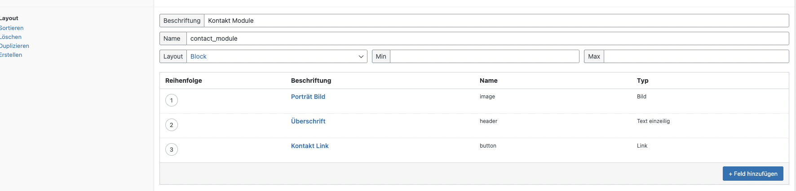

# krawall & wunder Starter WP Theme

Basic WP theme for setting up new projects.

## Features

- Timber Support (https://timber.github.io/docs/) (https://de.wordpress.org/plugins/timber-library/)
- ACF Pro Support (https://www.advancedcustomfields.com/resources/)
- Alpine.js (https://github.com/alpinejs/alpine)
- TailwindCSS Support (https://tailwindcss.com/)
- SVG Inject (https://github.com/iconfu/svg-inject)

## Required Plugins

- Timber (https://wordpress.org/plugins/timber-library/)

## Setup & Development

```bash
# install dependencies and set up necessary tools
$ yarn setup

# start development process and watch styles/scripts
$ yarn dev

# compile, lint and format theme for production
$ yarn prod
```

## Flexible Content with ACF and Twig

We use Timber and Twig as a template engine within this starter. To get it handy working with the ACF Flexbile Content Module there is a `modules-loader.twig` file which automatically loads all ACF modules in the folder `/modules`.

page-modules.php

```php
$context = Timber::get_context();
$context['page'] = new Timber\Post();
$context['layout'] = get_field('modules');
Timber::render('modules-loader.twig', $context);
```

modules-loader.twig

```twig

    
        
    

```

### Naming of the modules

The naming of the module has to match with the naming in the ACF Panel. So for example: To add the markup for a layout called Contact Module with the id contact-module in a flexbile content field the matching twig file has to be named `contact-module`.


